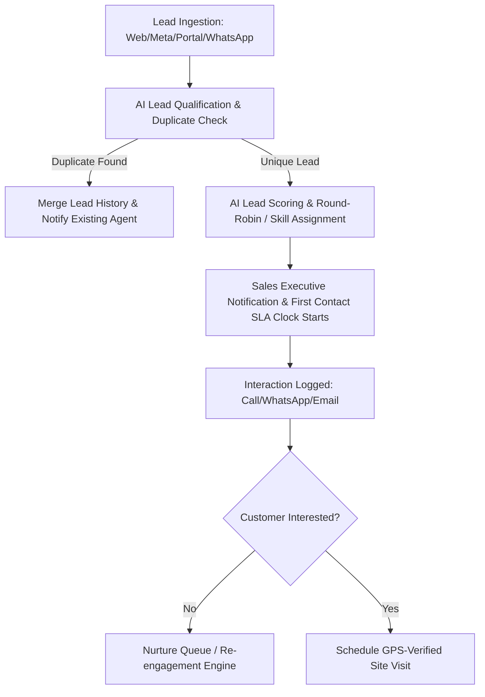
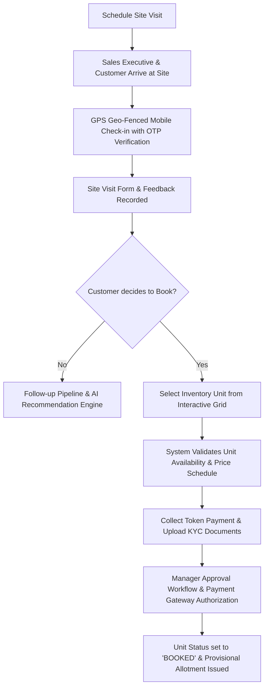
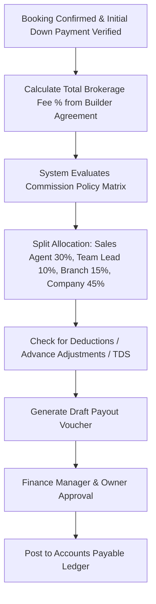

# Business Requirement Document (BRD)
## Swaramayi Real Estate Marketing – Enterprise Real Estate Brokerage ERP, CRM & AI Business Operating System

---

## 1. Executive Summary
**Swaramayi Real Estate Marketing** requires an end-to-end Enterprise Resource Planning (ERP), Customer Relationship Management (CRM), Human Resource Management System (HRMS), Financial Accounting, and AI-driven Operating System. The primary strategic goal is to transform the brokerage into a **system-driven enterprise** capable of scaling operations across multiple branches while automating over 90% of routine workflows, securing proprietary data against theft, eliminating commission fraud, and empowering leadership with predictive AI insights.

---

## 2. Business Objectives & Success Criteria
1. **Systemic Automation**: Automate >90% of daily operational tasks including lead assignment, follow-up scheduling, site visit validation, commission split calculations, invoice generation, and payroll processing.
2. **Zero Data Theft (Data Sovereignty)**: Prevent sales executives, managers, or third-party vendors from copying, exporting, or extracting client details via strict RBAC, data masking, download limits, and device binding.
3. **Financial Integrity & Commission Governance**: Eliminate manual commission calculations. Enforce multi-tier, system-calculated commission split rules with mandatory executive approval workflows.
4. **Immutable Auditability**: Log 100% of user actions, database reads/writes, authentication attempts, export requests, and administrative overrides in an unalterable audit ledger.
5. **Real-time Executive Oversight**: Enable company owners and directors to monitor active site visits, sales pipelines, cash flows, employee locations, and fraud risk scores in real-time from any device.

---

## 3. Scope of the System

### 3.1 In-Scope Modules
- **Company & Multi-Branch Architecture**: Multi-entity hierarchy supporting regional branches, franchises, cost centers, and team divisions.
- **Role-Based Access Control (RBAC)**: Fine-grained permission matrix with dynamic role definitions and field-level visibility controls.
- **Lead & CRM Management**: Multi-channel lead ingestion (Meta, Google, WhatsApp, Portals), AI scoring, auto-assignment, lead lifecycle tracking, and loss prevention.
- **Property & Inventory Management**: Master project catalog, tower/phase breakdowns, unit grid matrix, dynamic pricing tiers, blocking/reservation rules.
- **Sales & Site Visit Management**: GPS-verified site visits, digital booking forms, unit allocation, document collection, agreement milestone tracking.
- **Commission Split & Payout Engine**: Tiered agent commissions, team leader overwrites, channel partner payouts, builder commission invoicing, clawback management.
- **Finance & Double-Entry Accounting**: Chart of accounts, general ledger, payment gateways, builder milestone invoicing, expense tracking, accounts receivable/payable.
- **HRMS & GPS Attendance**: Employee lifecycle, geo-fenced mobile attendance with face verification check, leave tracking, performance scoring, automated payroll generation.
- **Anti-Fraud & Threat Protection Engine**: Real-time detection of duplicate leads, fake bookings, GPS spoofing, bulk data exports, unauthorized device access, price tampering.
- **AI Business Operating System**: AI Voice Receptionist, AI WhatsApp Assistant, lead scoring algorithm, AI proposal generator, revenue forecasting, fraud anomaly detection.
- **Portals & Dashboards**: Owner/Executive Dashboard, Manager Portal, Sales Representative Mobile/Web Interface, Customer Self-Service Portal, Builder/Developer Portal.

### 3.2 Out-of-Scope (Phase 1)
- Direct integration with international real estate exchanges outside national jurisdiction.
- Legacy physical hardware lock integration (smart door locks on property sites).

---

## 4. Key Stakeholders & User Roles

| User Role | Description & Operational Responsibilities | Key System Access |
| :--- | :--- | :--- |
| **Super Admin / Executive Owner** | Business owners with total operational visibility and authority. | Unrestricted global access, emergency lockdown control, AI revenue forecasts, financial ledgers. |
| **Branch Manager** | Manages regional branch performance, team leaders, and high-value bookings. | Branch-wide lead pipeline, approval over unit bookings, branch P&L metrics, staff attendance. |
| **Team Leader / Sales Manager** | Oversees a team of sales executives, assigns leads, monitors site visits. | Team leads, site visit approvals, team commission previews, lead escalation queue. |
| **Sales Executive / Agent** | Directly interacts with leads, conducts site visits, captures booking details. | Assigned leads (masked customer contact numbers), personal schedule, site visit check-in tool. |
| **Finance / Accounts Specialist** | Handles client payments, builder commission invoices, tax, and payroll. | Financial ledger, payment gateway logs, builder billing console, payroll disbursement. |
| **HR Specialist** | Manages staff onboarding, attendance overrides, performance appraisals. | Employee records, attendance logs, leave requests, performance metrics. |
| **Builder / Developer Partner** | External partner providing inventory updates, reviewing sales allocations. | Builder Portal: Project status, unit inventory updates, payment clearance logs. |
| **End Customer / Buyer** | Property buyer tracking booking milestones, agreements, and payments. | Customer Portal: Booking summary, payment receipts, document downloads. |

---

## 5. Core Business Workflows

### 5.1 Lead Lifecycle Workflow

### 5.2 Site Visit to Unit Booking Workflow

### 5.3 Commission Split Workflow

---

## 6. Business Constraints & Compliance Rules
1. **Rule of ERP Entry**: No customer interaction, site visit, payment, or agreement is legally recognized by Swaramayi Real Estate Marketing unless recorded in the ERP system.
2. **Customer Contact Masking**: Customer phone numbers and emails MUST be masked (e.g., `+91 98*** **321`) for all sales executives and team leads. Calling must occur through the built-in softphone or masked IVR system.
3. **Price Protection**: Sales agents cannot offer discounts or alter unit prices beyond the authorized discount matrix configured by the Super Admin for a given project.
4. **Approval Gateways**:
   - Booking Cancellation: Requires Branch Manager + Finance Manager approval.
   - Commission Payout: Requires Owner/Super Admin digital signature.
   - Data Export Request: Requires Owner explicit OTP authorization.

---

## 7. Operational Metrics (KPIs)
- **Lead Contact SLA**: 100% of incoming leads contacted within 15 minutes.
- **Site Visit Conversion Rate**: Target >25% conversion from site visit to booking.
- **Commission Settlement Cycle**: System calculation within 60 seconds of builder payment verification.
- **Attendance Accuracy**: 99.9% fraud-free attendance verification using combined GPS + Face Recognition.
- **System Uptime**: 99.99% operational availability with continuous audit logging.
