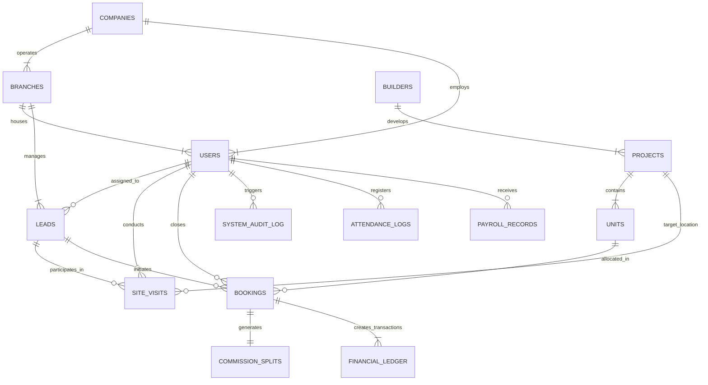
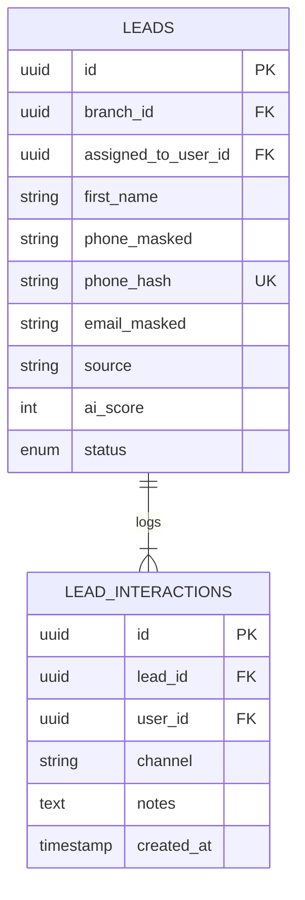
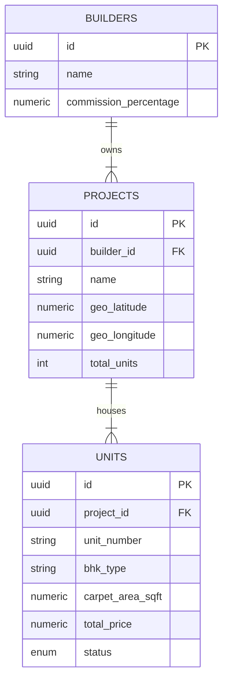
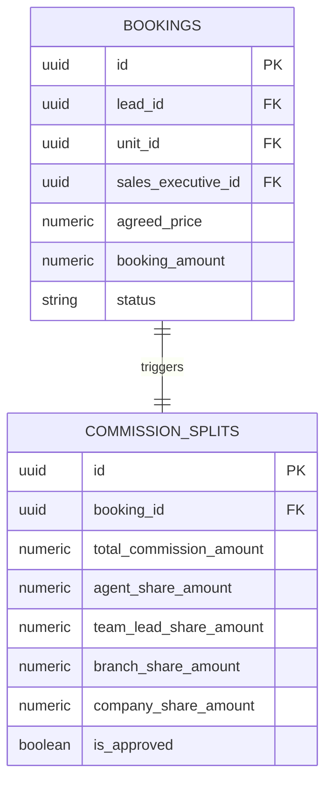

# Entity Relationship (ER) Diagram
## Swaramayi Real Estate Marketing – Enterprise Real Estate Brokerage ERP, CRM & AI Business Operating System

---

## 1. Overview & Data Architecture Models
The relational entity diagram maps out the multi-tenant branch structure, CRM lead acquisition engine, property inventory catalog, sales booking workflows, commission splits, HRMS, and audit shield layer.

---

## 2. Global Entity Relationship Diagram (Mermaid)

---

## 3. Module-Specific Sub-Schemas

### 3.1 Lead Management & CRM Sub-Schema

### 3.2 Property & Inventory Grid Sub-Schema

### 3.3 Commission & Payout Sub-Schema

